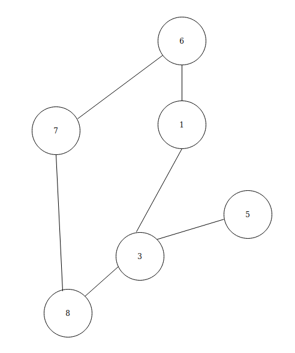
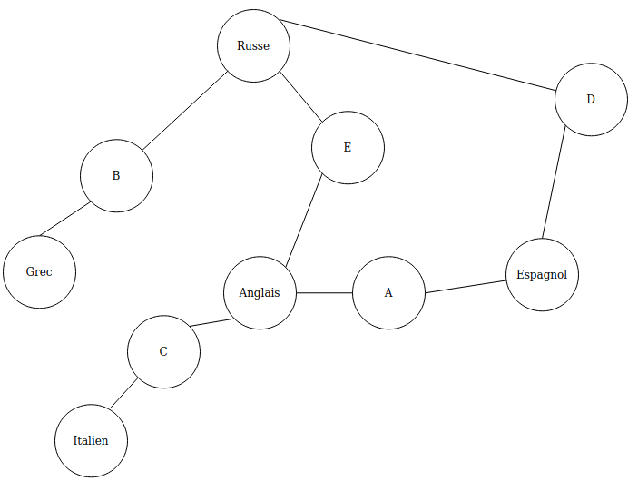

# TP 6 TD

## Exercises 1

1) Non

2) Les sommet : les points numérotés; les artes le liens entre les aretes 

3) 7,4 et 5; le sommet 10 est de degré 3

4) 3-régulier

5) Matrice d'incidence

|    | 1 | 2 | 3 | 4 | 5 | 6 | 7 | 8 | 9 | 10 |
|----|---|---|---|---|---|---|---|---|---|----|
| 1  | 0 | 0 | 1 | 1 | 0 | 1 | 0 | 0 | 0 | 0  |
| 2  | 0 | 0 | 0 | 1 | 1 | 0 | 1 | 0 | 0 | 0  |
| 3  | 1 | 0 | 0 | 0 | 1 | 0 | 0 | 1 | 0 | 0  |
| 4  | 1 | 1 | 0 | 0 | 0 | 0 | 0 | 0 | 1 | 0  |
| 5  | 0 | 1 | 1 | 0 | 0 | 0 | 0 | 0 | 0 | 1  |
| 6  | 1 | 0 | 0 | 0 | 0 | 0 | 1 | 0 | 0 | 1  |
| 7  | 0 | 1 | 0 | 0 | 0 | 1 | 0 | 1 | 0 | 0  |
| 8  | 0 | 0 | 1 | 0 | 0 | 0 | 1 | 0 | 1 | 0  |
| 9  | 0 | 0 | 0 | 1 | 0 | 0 | 0 | 1 | 0 | 1  |
| 10 | 0 | 0 | 0 | 0 | 1 | 1 | 0 | 0 | 1 | 0  |

Matrice d'adjacence

|    | {1;3} | {1;4} | {1;6} | {2;5} | {2;4} | {2;7} | {3;5} | {3;8} | {4;9} | {5;10} | {6;7} | {6;10} | {7;8} | {8;9} | {9;10} |
|----|-------|-------|-------|-------|-------|-------|-------|-------|-------|--------|-------|--------|-------|-------|--------|
| 1  | 1     | 1     | 1     | 0     | 0     | 0     | 0     | 0     | 0     | 0      | 0     | 0      | 0     | 0     | 0      |
| 2  | 0     | 0     | 0     | 1     | 1     | 1     | 0     | 0     | 0     | 0      | 0     | 0      | 0     | 0     | 0      |
| 3  | 1     | 0     | 0     | 0     | 0     | 0     | 1     | 1     | 0     | 0      | 0     | 0      | 0     | 0     | 0      |
| 4  | 0     | 1     | 0     | 0     | 1     | 0     | 0     | 0     | 1     | 0      | 0     | 0      | 0     | 0     | 0      |
| 5  | 0     | 0     | 0     | 1     | 0     | 0     | 1     | 0     | 0     | 1      | 0     | 0      | 0     | 0     | 0      |
| 6  | 0     | 0     | 1     | 0     | 0     | 0     | 0     | 0     | 0     | 0      | 1     | 1      | 0     | 0     | 0      |
| 7  | 0     | 0     | 0     | 0     | 0     | 1     | 0     | 0     | 0     | 0      | 1     | 0      | 1     | 0     | 0      |
| 8  | 0     | 0     | 0     | 0     | 0     | 0     | 0     | 1     | 0     | 0      | 0     | 0      | 1     | 1     | 0      |
| 9  | 0     | 0     | 0     | 0     | 0     | 0     | 0     | 0     | 1     | 0      | 0     | 0      | 0     | 1     | 1      |
| 10 | 0     | 0     | 0     | 0     | 0     | 0     | 0     | 0     | 0     | 1      | 0     | 1      | 0     | 0     | 1      |

6)

7) Non

8) Non

## Exercise 2
1) 

2) 4+3+2+1=10 binomes

3) 2

4) Oui

5) Italien, Espagnol, Grec en meme temps; 3 crénaux

## Exercice 3

1) Non

2) Oui

3) 1128

## Exercice 4